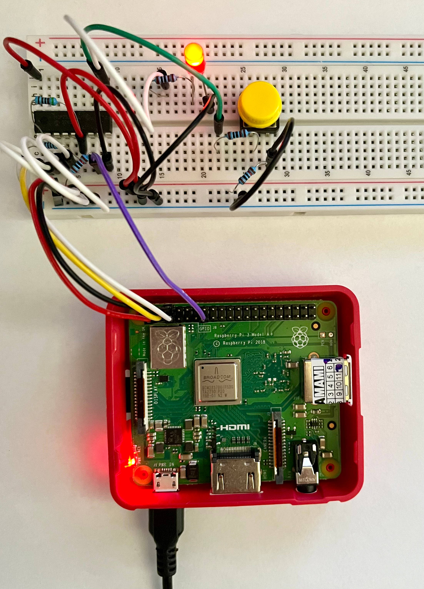

# MCP23008 GPIO expander Linux driver
This repository contains Linux kernel driver for MCP23008 GPIO expander.
 
Overview:
* Uses I2C
* Device Tree support
* Uses `regmap`
* Supports interrupts on expander pins

## Building the driver
Following steps show how to build the driver on target system, RPi 3A+ has been used as an example:
* Run `make` in the cloned repository to build the driver kernel module
* Build device tree overlay: `dtc -@ -I dts -O dtb -o pi3a.dtbo dt/pi3a.dts`
* Load the overlay: `sudo dtoverlay pi3a.dtbo`
* Load the module: `sudo insmod mcp23008.ko`

Required packages: `linux-headers`, `build-essential`, `device-tree-compiler`